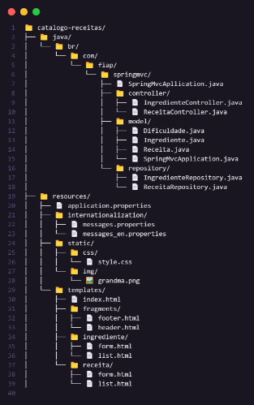

# ReceitaFofa

## 🍰 Sobre o Projeto  
Projeto desenvolvido para o **Checkpoint 05** da matéria de **Java - Desenvolvimento Web com Spring**, ministrada pelo professor **Luiz Gustavo dos Santos Real**.

A aplicação **catalogo-receitas** é uma evolução de um projeto criado anteriormente em Python. Seu objetivo é permitir o cadastro e exibição de receitas culinárias, com foco em uma estética acolhedora, inspirada na “vibe de vó”. A aplicação também consome uma API externa de receitas, com suporte para tradução automática.

---

## ✨ Funcionalidades

- Cadastro, listagem, edição e exclusão de receitas  
- Interface simples com navegação intuitiva via Thymeleaf  
- Integração com API externa de receitas e tradução  
- Estrutura em Spring MVC com controllers, services e repositories  
- Internacionalização (suporte a português e inglês)  
- Design inspirado em um estilo retrô/fofinho com mascote

---

## 📂 Estrutura do Projeto

O projeto foi baseado na estrutura apresentada pelo professor, com adaptações para atender às necessidades específicas do projeto.





---

## 🚀 Como Rodar o Projeto

1. **Clone o repositório**
   ```bash
   git clone https://github.com/mulliru/Check-Point-05-Java-Advanced
   cd catalogo-receitas
   ```

2. **Abra no IntelliJ ou Eclipse**

3. **Configure o banco de dados (caso necessário)**  
   Atualize o `application.properties` com suas credenciais

4. **Execute a aplicação**  
   Use a classe com `@SpringBootApplication` como ponto de partida

5. **Acesse no navegador**
   ```
   http://localhost:8080
   ```

---


## 👩‍🍳 Referências e Inspiração

- Projeto original em Python feito no 2º semestre da FIAP  
- Estética "vibe de vó" e mascote reutilizados com carinho  
- Estrutura base orientada pelo professor em sala

---

## 👨‍💻 Desenvolvido por:

**Murillo Ferreira Ramos**  
**RM 553315**
